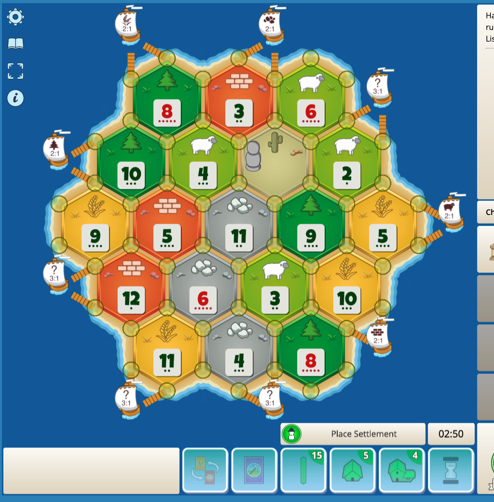

玩了一場完全沒磚頭 只有小木頭的

專用應換的

很多石頭麥子羊

升級 = 6分
最長道路 應換來的2分
vp 2分

再一場

我一樣玩有石頭 石頭沒很好 有羊有麥有磚 搶31港口 然後升級 
大家卡磚 我最長路

city 6
vp 1
longest road 2

拿最多資源
木 磚 麥

然後拿小石 木 羊

搶31港口
準備蓋路蓋房
瘋狂被檔耶 沒磚頭
第二名 沒最長路也沒最大軍隊 差一隻

拿麥子石頭磚塊 然後拿麥子 小木 小羊
一樣升級+抽卡
city 6
road 2
vp 1
house 1
抽到兩條路 換得好爽 直接狂蓋路和房

next
爆炸 沒石頭沒磚頭
house 3
city 2
沒了
沒港口
很多羊 沒用
藍色超多石頭+31港

next
沒麥子 31港硬換一堆麥子升級
超多石頭 爽換 

6 city
2 house
2 road
win

next
9p 2nd place 剛好兩個大點都是348
8 city
1 vp
骰不到羊

next
缺羊
8麥
4石
6磚
有羊就換
3 house
4 city
1 vp
1 road

玩法解析
玩木磚的話
最長道路
換麥和羊
這樣可以有5+2分
